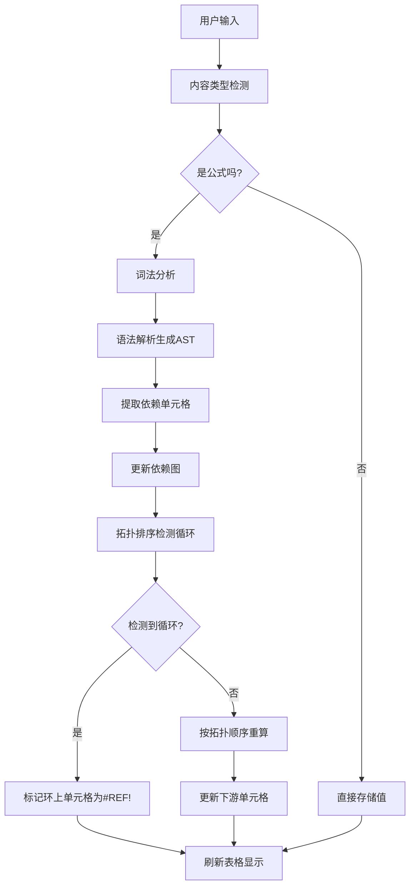

## 1. 产品概述

浏览器内电子表格应用，支持 Excel 风格的公式计算、依赖图重算和循环引用检测，提供完整的表格数据处理能力。

- 面向需要在线数据计算和分析的用户，提供类 Excel 的使用体验
- 核心价值：高性能公式引擎、智能依赖追踪、数据持久化存储

## 2. 核心功能

### 2.1 用户角色

| 角色 | 注册方式 | 核心权限 |
|------|----------|----------|
| 普通用户 | 无需注册 | 创建、编辑、保存、加载工作簿，导出 CSV |

### 2.2 功能模块

1. **表格主界面**：100×26 虚拟滚动表格、公式栏、工具栏
2. **公式引擎**：词法分析、语法解析、求值器、内置函数库
3. **依赖管理**：依赖图构建、拓扑排序重算、循环引用检测
4. **数据持久化**：工作簿保存/加载、CSV 导出

### 2.3 页面详情

| 页面名称 | 模块名称 | 功能描述 |
|-----------|-------------|---------------------|
| 主页面 | 虚拟滚动表格 | 支持 100 行 × 26 列，Canvas 自绘，高性能滚动 |
| 主页面 | 公式栏 | 显示当前单元格公式，支持编辑和确认 |
| 主页面 | 工具栏 | 保存、加载、新建、导出 CSV、格式化按钮 |
| 主页面 | 单元格编辑器 | 支持文本、数字、日期、公式输入 |
| 主页面 | 工作簿列表 | 显示已保存的工作簿，支持选择加载 |

## 3. 核心流程

### 3.1 单元格编辑流程

用户在单元格中输入内容 → 解析内容类型（文本/数字/日期/公式）→ 公式解析生成 AST → 提取依赖单元格 → 更新依赖图 → 拓扑排序检测循环 → 重算下游依赖单元格 → 更新表格显示

### 3.2 流程图

## 4. 用户界面设计

### 4.1 设计风格

- 主色调：专业办公风格，深蓝 `#1e40af` 作为主色，灰色 `#f3f4f6` 背景
- 强调色：绿色 `#059669` 表示正确，红色 `#dc2626` 表示错误/循环引用
- 按钮风格：扁平化设计，圆角 4px，悬停有背景色变化
- 字体：使用 `JetBrains Mono` 等宽字体用于单元格内容，`Inter` 用于界面文本
- 布局：顶部工具栏 + 公式栏 + 主表格区域 + 底部状态栏
- 图标风格：使用 lucide-react 线性图标

### 4.2 页面设计概述

| 页面名称 | 模块名称 | UI 元素 |
|-----------|-------------|-------------|
| 主页面 | 工具栏 | 图标按钮组：新建、保存、加载、导出 CSV、数字格式、日期格式 |
| 主页面 | 公式栏 | 单元格地址显示、等号图标、公式输入框、确认/取消按钮 |
| 主页面 | 表格区域 | Canvas 绘制，列标题 A-Z，行标题 1-100，网格线，选中高亮 |
| 主页面 | 单元格编辑器 | 浮层 input，支持自动补全函数名 |
| 主页面 | 状态栏 | 显示当前选中单元格、重算时间、循环引用警告 |

### 4.3 响应式

- 桌面端优先设计，表格区域自适应窗口大小
- 工具栏在小屏幕下可滚动
- 触摸设备支持单元格点击和双指缩放

### 4.4 视觉动效

- 单元格值变化时有淡入过渡动画
- 循环引用单元格有轻微红色闪烁提示
- 公式栏聚焦时有边框高亮动画
- 工具栏按钮悬停有缩放效果
