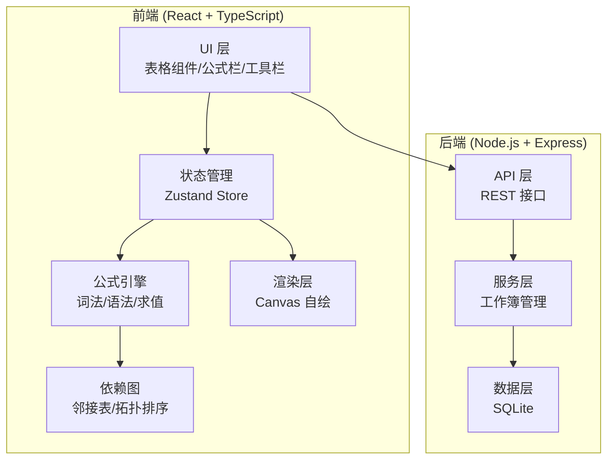
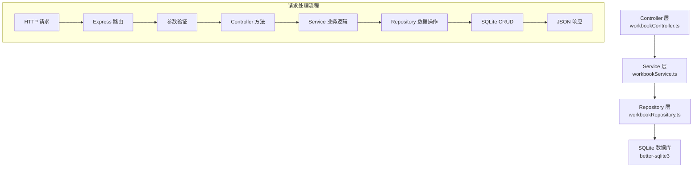
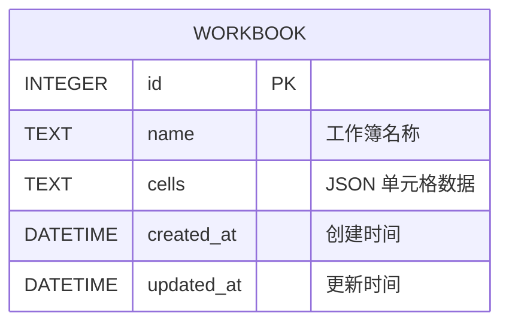

## 1. 架构设计



## 2. 技术描述

- **前端**: React@18 + TypeScript@5 + Vite@5 + TailwindCSS@3 + Zustand@4
- **后端**: Express@4 + better-sqlite3@9 + TypeScript@5
- **数据库**: SQLite (文件存储，无外部服务依赖)
- **初始化工具**: vite-init (react-express-ts 模板)
- **包管理器**: npm (优先使用 pnpm，回退到 npm)

## 3. 路由定义

### 前端路由

| 路由 | 页面 | 说明 |
|-------|------|------|
| `/` | 主页面 | 电子表格主界面 |
| `/workbooks` | 工作簿列表 | 已保存工作簿列表 |

### 后端 API 路由

| 方法 | 路由 | 目的 |
|-------|-------|---------|
| GET | `/api/workbooks` | 获取工作簿列表 |
| GET | `/api/workbooks/:id` | 加载指定工作簿 |
| POST | `/api/workbooks` | 保存新工作簿 |
| PUT | `/api/workbooks/:id` | 更新工作簿 |
| DELETE | `/api/workbooks/:id` | 删除工作簿 |
| GET | `/api/workbooks/:id/export` | 导出 CSV |

## 4. API 定义

### 数据类型定义

```typescript
// 单元格类型
type CellType = 'text' | 'number' | 'date' | 'formula' | 'error';

// 单元格格式
interface CellFormat {
  decimalPlaces?: number;
  useThousandsSeparator?: boolean;
  dateFormat?: 'YYYY-MM-DD' | 'MM/DD/YYYY';
  isBold?: boolean;
  isItalic?: boolean;
  textColor?: string;
  backgroundColor?: string;
}

// 单元格数据
interface Cell {
  id: string;          // A1, B2, 等
  type: CellType;
  rawValue: string;    // 原始输入值
  value: string | number | Date | null;  // 计算后的值
  formula?: string;    // 公式字符串
  format?: CellFormat;
  isError?: boolean;
  errorMessage?: string;
  isCircular?: boolean;
}

// 工作簿
interface Workbook {
  id?: number;
  name: string;
  cells: Record<string, Cell>;
  createdAt?: string;
  updatedAt?: string;
}

// 工作簿列表项
interface WorkbookListItem {
  id: number;
  name: string;
  updatedAt: string;
}
```

### 请求/响应 Schema

#### GET /api/workbooks
- 响应: `{ data: WorkbookListItem[] }`

#### GET /api/workbooks/:id
- 响应: `{ data: Workbook }`

#### POST /api/workbooks
- 请求体: `{ name: string; cells: Record<string, Cell> }`
- 响应: `{ data: Workbook }`

#### PUT /api/workbooks/:id
- 请求体: `{ name: string; cells: Record<string, Cell> }`
- 响应: `{ data: Workbook }`

## 5. 服务器架构图



## 6. 数据模型

### 6.1 数据模型定义



### 6.2 DDL 语句

```sql
-- 工作簿表
CREATE TABLE IF NOT EXISTS workbooks (
    id INTEGER PRIMARY KEY AUTOINCREMENT,
    name TEXT NOT NULL DEFAULT 'Untitled',
    cells TEXT NOT NULL DEFAULT '{}',
    created_at DATETIME DEFAULT CURRENT_TIMESTAMP,
    updated_at DATETIME DEFAULT CURRENT_TIMESTAMP
);

-- 更新时间触发器
CREATE TRIGGER IF NOT EXISTS update_workbooks_timestamp 
AFTER UPDATE ON workbooks
FOR EACH ROW
BEGIN
    UPDATE workbooks SET updated_at = CURRENT_TIMESTAMP WHERE id = OLD.id;
END;

-- 索引
CREATE INDEX IF NOT EXISTS idx_workbooks_updated_at ON workbooks(updated_at DESC);
```

## 7. 核心模块设计

### 7.1 公式引擎模块

**文件**: `src/utils/formula/`

- `lexer.ts` - 词法分析器，将公式字符串解析为 Token 流
- `parser.ts` - 递归下降语法解析器，生成 AST
- `ast.ts` - AST 节点类型定义
- `evaluator.ts` - 求值器，遍历 AST 计算结果
- `functions.ts` - 内置函数库 (SUM, AVERAGE, IF, VLOOKUP 等)

### 7.2 依赖图模块

**文件**: `src/utils/dependency/`

- `DependencyGraph.ts` - 邻接表存储的有向图
- `topologicalSort.ts` - 拓扑排序算法
- `cycleDetector.ts` - 循环引用检测

### 7.3 表格渲染模块

**文件**: `src/components/Spreadsheet/`

- `VirtualGrid.tsx` - Canvas 虚拟滚动表格
- `FormulaBar.tsx` - 公式栏组件
- `CellEditor.tsx` - 单元格编辑器
- `Toolbar.tsx` - 工具栏

### 7.4 状态管理

**文件**: `src/store/useSpreadsheetStore.ts`

- 单元格数据管理
- 选中状态管理
- 依赖图状态
- 重算调度
